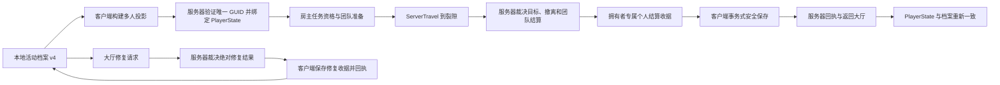

# ProjectRift v0.6.0 新任务开发交接

生成日期：2026-07-14  
项目：`E:\MyWork\ProjectA`  
当前分支：`main`  
当前基线提交：`1f2ae68`（`v0.5.6 自动化 Smoke Test 与本地构建脚本`）  
当前项目版本：`0.5.6`  
当前玩家档案格式：v4

`1f2ae68` 是 v0.5.6 的实现基线；用户提交本交接文档后，`main` 可以位于其仅含文档变更的后继提交，新任务应以实际干净 `main` 为准。

## 1. 文档用途

本文件用于把 ProjectRift 当前状态交给一个全新的 Codex 任务。新任务应先阅读本文件和仓库内的权威资料，再根据用户提供的正式 v0.6.0 路线拆分、规划和实现。

本文件不是 v0.6.0 的功能规格，也不授权立即修改代码。仓库内目前没有完整的 v0.6.0 正式路线内容，因此不得仅根据版本号猜测玩法、数据合同、UI 或资产需求。

新任务的推荐阅读顺序：

1. `AGENTS.md`
2. `docs/projectrift/v0.6.0-task-handoff.md`
3. `CHANGELOG.md`
4. `docs/projectrift/v0.5.6-test-record.md`
5. `docs/projectrift/known-issues.md`
6. 与用户本次明确启动的小版本直接相关的源码、测试和正式路线章节

## 2. 不可违反的项目边界

- 只能操作 `E:\MyWork\ProjectA`、明确属于 `ProjectA.uproject` 的编辑器/游戏进程，以及 ProjectA 的 `127.0.0.1:8001/mcp`。
- 不得访问、探测或使用端口 8000，不得读取、检查、停止或修改 ProjectR 和其他项目。ProjectR 必须保持运行。
- Unreal MCP 只用于 ProjectA 编辑器开发和资产操作，不得成为运行时依赖。
- 保持 `main` 分支。用户负责暂存、提交、标签、推送和 PR；Codex 不执行任何 Git 写操作。
- 采用严格小版本交付制：只实现用户明确说“开始”的小版本；完成构建、测试和交付后立即停止，等待用户验收和提交。
- 允许按需要正常关闭或打开 ProjectA 编辑器，但只能匹配完整 `E:\MyWork\ProjectA\ProjectA.uproject` 命令行；关闭失败时不得强杀。
- 不得删除、覆盖或尝试自动修复共享 UE 安装的重要文件。尤其要保护：
  `D:\Unreal Engine 5\UE_5.8\Engine\Binaries\Win64\UnrealEditor.modules`。
- Epic Launcher 验证后的上述文件基线为 32,290 字节，SHA-256：
  `BBE466E4330F3FDDEA1120A9070A7402F5A9655404223F55C9E0D1D322568747`。
- 如果共享 UE 文件缺失或发生变化，立即停止并报告；不要自行从备份写回引擎目录。

## 3. 当前仓库基线

| 项目 | 当前状态 |
| --- | --- |
| Git | `main` 与 `origin/main` 均位于 `1f2ae68`，生成本文前工作区干净 |
| Unreal Engine | UE 5.8，`ProjectA.uproject` 的 `EngineAssociation` 为 `5.8` |
| 游戏显示版本 | `Config/DefaultGame.ini` 中为 `0.5.6` |
| 玩家档案格式 | `UPRProfileSave::LatestSaveVersion = 4` |
| 默认地图 | `/Game/ProjectRift/Maps/L_ShipLobby` |
| Cook 地图 | `L_MainMenu`、`L_ShipLobby`、`L_Rift_Test` |
| 网络结构 | 监听服务器；服务器裁决运行时玩法，客户端只保存自己的本地档案 |
| MCP | ProjectA 专用 `127.0.0.1:8001/mcp` |
| 最新完整回归 | 62/62 ProjectRift 自动化测试通过 |
| 本地包 | Win64 Development 与 Shipping 均已生成并验证 |

关键提交历史：

| 版本 | 提交 | 主题 |
| --- | --- | --- |
| v0.4.8 | `70c7e7f` | Vertical Slice 稳定化、回归保护与打包基线 |
| v0.5.0 | `5228850` | Primary DataAsset 与 AssetManager 基础 |
| v0.5.1 | `815252a` | GameplayTag 合同与项目调参设置 |
| v0.5.2 | `5361c7a` | 版本化玩家档案与安全保存 |
| v0.5.3 | `a53febd` | 多人个人进度与团队主线政策 |
| v0.5.4 | `f902234` | 舰船修复与章节解锁系统 |
| v0.5.5 | `412bc05` | 开发者工具、日志与诊断 HUD |
| v0.5.6 | `1f2ae68` | 自动化 Smoke Test 与本地构建脚本 |

## 4. 已完成能力

### 4.1 Vertical Slice 与运行闭环

- 已有大厅准备、角色/职责状态、监听服务器旅行、裂隙目标、敌人生成、掉落拾取、撤离、结算和返回大厅闭环。
- `RunId`、`MissionId`、`SettlementId` 已稳定化；重复完成、失败、击杀和结算不会重复记账。
- 运行结束和旅行时清理定时器、委托、敌人引用及临时状态。
- 现有物品、背包、丢弃、拾取、消耗品、GAS、伤害、倒地/复活和网络移动均有回归测试。

### 4.2 AssetManager、Primary DataAsset 与配置合同

`UPRAssetManager` 是全局 AssetManager，当前注册四种 AlwaysCook Primary Asset：

- `ProjectRiftItem`：`/Game/ProjectRift/Items`
- `ProjectRiftLootTable`：`/Game/ProjectRift/Items`
- `ProjectRiftMission`：`/Game/ProjectRift/Missions`
- `ProjectRiftShipRepair`：`/Game/ProjectRift/ShipRepairs`

当前关键资产：

- `/Game/ProjectRift/Items/DA_CommonChip`
- `/Game/ProjectRift/Items/DA_EnergyCrystal`
- `/Game/ProjectRift/Items/DA_HealthInjector`
- `/Game/ProjectRift/Items/DA_ShieldPack`
- `/Game/ProjectRift/Items/DA_TestLootTable`
- `/Game/ProjectRift/Missions/DA_RiftTestMissionProgression`
- `/Game/ProjectRift/ShipRepairs/DA_RepairEngineStage1`

GameplayTag 使用原生合同，项目调参集中在 `UPRProjectSettings`，不应重新引入 Actor/Blueprint 重复配置源。

### 4.3 v4 玩家档案与安全保存

主要入口：`UPRSaveSubsystem`、`UPRProfileSave`、`FPRProfileSnapshot`、`FPRSafeSaveStore`。

- 多档案使用 GUID，支持创建、枚举、激活、删除和活动档案持久化。
- 正式档案根目录为 `Saved/SaveGames/ProjectRift`；自动化必须使用 ProjectA 的 `Saved/Automation` 隔离根。
- 保存采用 SaveGame 内存序列化与外层魔数、载荷长度、版本和 CRC32 封装。
- 每档维护 primary、backup、tmp 和最多一份 corrupt；支持写入回读、备份轮换、损坏恢复和目录索引重建。
- 未来版本拒绝加载，不会回退或改写；迁移链为 v1 → v2 → v3 → v4。
- 快照已覆盖钱包、背包、仓库、装备、角色、舰船模块、剧情和强类型玩家设置。
- 持久化合同只使用 GUID、名称、字符串和数值，不保存 Actor、Component、UObject 或资产指针。
- `ProcessedSettlementIds` 和 `ProcessedRepairTransactionIds` 各保留最多 128 条，用于跨重启幂等。
- 写盘失败时不替换内存活动快照，并保留可重试收据。

### 4.4 多人个人进度与团队主线

- 每名玩家必须用唯一有效的档案 GUID 绑定多人投影后才能准备。
- 投影只传输会话需要的档案数据；服务器不读取或写入远端玩家档案文件。
- 房主选择团队任务，服务器通过 ServerTravel URL 携带并重新验证 `MissionId`。
- 当前任务为 `Mission.Rift.Test.Hold`，地图为 `L_Rift_Test`，完成节点为 `Story.Prologue.RiftTestHold`。
- 服务器为仍连接玩家生成个人结算收据；客户端事务式写入自己的活动档案并回执。
- 成功撤离且满足前置条件才推进个人剧情；失败、未撤离和掉线遵循 v0.5.3 的既定保留/不补发政策。
- 结算等待下限为 4 秒，全部回执或最长 8 秒后返回大厅；失败收据在大厅重试。
- 档案绑定、运行基线、剧情和舰船投影通过无缝旅行保留。

### 4.5 舰船修复与章节解锁

- 修复合同由 `UPRShipRepairDataAsset` 驱动，支持 ID、成本、剧情/修复前置、模块等级和章节结果校验。
- 当前项目 `Repair.Ship.Engine.Stage1` 消耗 `EnergyCrystal ×10`，要求 `Story.Prologue.RiftTestHold`，完成后将 `Ship.Module.Engine` 升至 1 级并解锁/切换到 `Chapter.One`。
- 修复由服务器裁决，客户端只安全保存自己的绝对状态收据；重复交易不会二次扣费。
- 保存失败会阻止准备和再次修复，并在大厅每 5 秒自动重试。
- 正式原生 `UPRShipRepairWidget` 在 `L_ShipLobby` 按 R 打开，Esc 关闭，与背包和诊断面板互斥；开发验收辅助在 Shipping 中隐藏。

### 4.6 开发者工具、日志与诊断 HUD

- `UPRDiagnosticsSubsystem` 提供 Development-only 的 500 条结构化事件环形缓冲区、健康快照、筛选和 UTF-8 JSON 导出。
- `UPRDeveloperToolsSubsystem` 集中提供受控的档案、检查点、旧档、修复准备、测试掉落、准备/开始和故障注入操作。
- `UPRDiagnosticsWidget` 使用 F1 打开，包含 Overview、Player、Team & Rift、Events 和 Tools；Esc 关闭。
- 已有 Flow、Gameplay、Network、Save、Assets、UI 和 Diagnostics 日志分类。
- 破坏性故障操作仅允许作用于 ProjectA `Saved/Automation` 的隔离档案根。

### 4.7 自动化、Gauntlet 与本地构建

- Development-only 插件 `ProjectRiftSmokeTests` 提供 `UPRLocalSmokeGauntletController`。
- `ProjectRift.Smoke` 包含 Content、ProfileIsolation 和 GauntletContract 三项快速测试。
- `ProjectRift.LocalSmoke` 以单个 Win64 Client 完成真实大厅 → ServerTravel → 拾取 → 目标 → 撤离 → 收据保存 → 返回大厅闭环。
- Gauntlet 档案固定在 `Saved/Automation/Gauntlet/<RunId>/Profiles`，无效 GUID、`-userdir` 或 ProjectA Automation 根会 fail-closed。
- Shipping 同时排除自定义 Smoke 插件和引擎 Gauntlet 插件。
- PowerShell 5.1 入口：`Scripts/ProjectRift/Invoke-ProjectRiftLocal.ps1`。

常用命令：

```powershell
# Editor 增量构建 + 3 项快速 Smoke
.\Scripts\ProjectRift\Invoke-ProjectRiftLocal.ps1

# 全部 ProjectRift 回归 + Development 包 + Gauntlet 完整闭环
.\Scripts\ProjectRift\Invoke-ProjectRiftLocal.ps1 -Mode Full

# Shipping 包、测试模块排除和有界 NullRHI 启动检查
.\Scripts\ProjectRift\Invoke-ProjectRiftLocal.ps1 `
  -Mode Build -Target Package -Configuration Shipping
```

流水线只从显式参数、`UE_ENGINE_ROOT` 或 ProjectA 自己的解决方案解析 UE 5.8，不扫描其他磁盘/项目。每次运行都会备份并校验共享 `UnrealEditor.modules`，但绝不自动写回共享引擎目录。

## 5. 当前核心数据流



必须保持的权威边界：

- 服务器负责游戏结果和绝对结算状态。
- 客户端只保存自己绑定的档案。
- 服务器不能访问远端本地文件，也不能代写其他玩家档案。
- 磁盘写入成功前不能替换客户端内存活动档案。
- 任何新交易或奖励都必须考虑网络重复调用、进程重启和跨版本迁移的幂等性。

## 6. 新任务首先要查看的源码入口

| 领域 | 入口文件 |
| --- | --- |
| 全局资产管理 | `Source/ProjectA/Core/PRAssetManager.h/.cpp` |
| 大厅和裂隙流程 | `Source/ProjectA/Core/PRShipLobbyGameMode.*`、`PRRiftGameMode.*` |
| 玩家 RPC/UI 生命周期 | `Source/ProjectA/Player/PRPlayerController.*` |
| 复制状态和会话基线 | `Source/ProjectA/Player/PRPlayerState.*` |
| 档案总入口 | `Source/ProjectA/Persistence/PRSaveSubsystem.*` |
| 安全磁盘协议 | `Source/ProjectA/Persistence/PRSaveStorage.*` |
| 档案数据和迁移 | `PRProfileTypes.*`、`PRProfileSave.*` |
| 多人投影和收据 | `Source/ProjectA/Multiplayer/PRMultiplayerProfileTypes.*` |
| 任务进度合同 | `Source/ProjectA/Progression/PRMissionProgressionDataAsset.*` |
| 舰船修复合同 | `Source/ProjectA/Ship/PRShipRepairDataAsset.*`、`PRShipRepairTypes.*` |
| 诊断和开发工具 | `Source/ProjectA/Diagnostics/*` |
| 原生 UI | `Source/ProjectA/UI/*` |
| 自动化测试 | `Source/ProjectA/Tests/*` |
| Gauntlet Smoke | `Plugins/ProjectRiftSmokeTests/*`、`Scripts/ProjectRift/Gauntlet/*` |

仓库代码、真实反射类名、Blueprint 引用、地图和资产优先于旧设计文档里的示例名称。不要批量重命名模块、反射类或现有资产。

## 7. 最新验证证据

- PowerShell 5.1 自测：31/31。
- 默认 Quick：ProjectAEditor Development 成功，`ProjectRift.Smoke` 3/3。
- 完整 ProjectRift 自动化：62/62，0 失败。
- Win64 Development BuildCookRun：成功。
- `ProjectRift.LocalSmoke`：`PROJECTRIFT_SMOKE_RESULT=PASS`。
- Win64 Shipping BuildCookRun：成功。
- Shipping 包中 `ProjectRiftSmokeTests`/Gauntlet 条目：0。
- Shipping NullRHI 十秒有界启动检查：成功。
- Development 可执行文件 SHA-256：`37BF958E38392D17F75769190B0A2C6868254E1BC15ABF6A328F6F1EA00B85D5`。
- Shipping 可执行文件 SHA-256：`08C171E1AF87EDD7D407B911B1E448C41F8BD9B9E92D753F9B6948FD773B55CE`。

详细证据见 `docs/projectrift/v0.5.6-test-record.md`。`Saved/Automation/LocalBuildRuns` 下的报告是本机生成物，不应假定在其他工作区长期存在。

## 8. 已知限制和未实现边界

以下内容不能误认为已经完成：

- Gauntlet 目前是单客户端，不是双客户端完整联机自动化。
- Shipping 自动检查只证明 NullRHI 进程健康存活，不代替人工图形化验收。
- 当前只有一个 starter 主线任务和一个引擎一级修复项目，没有正式任务/章节选择 UI。
- `Chapter.One` 已能解锁，但本交接资料不能证明 Chapter One 的正式内容已经实现。
- 没有 Steam Cloud、账号认证、反作弊、远端档案托管或恶意篡改防护。
- 没有掉线结算补发；结算前掉线玩家不生成个人收据。
- 没有循环舰船损伤、团队资源捐献、制作系统或场景维修终端。
- 没有 CI/GitHub Actions、双客户端 Gauntlet、性能基准或输入机器人。
- UAT 会报告非 Win64 平台 SDK 不可用；当前支持和验证目标是 Windows、Win64、PowerShell 5.1、UE 5.8。
- GameplayCue 搜索路径和退出后的 CrowdManager/NavMesh 警告仍记录在 `known-issues.md`，不得顺手扩大范围处理。

## 9. v0.6.0 新任务应按顺序开始的工作

### 阶段 A：建立正式需求输入

1. 先确认本文件所列基线仍为 `main`、`1f2ae68` 或其明确后继提交，且工作区没有未说明的重叠修改。
2. 让用户把 v0.6.0 正式路线相关章节附加到新任务，或复制到 ProjectA 仓库内的规划文档中。
3. 如果路线仍只位于 `E:\MyWork\ProjectA_Design`，不要越过 ProjectA 范围读取；请用户提供相关内容或明确调整范围。
4. 将路线中的示例类名、资产名和地图名与当前仓库真实实现逐项对照。

### 阶段 B：把大版本拆成严格小版本

1. 列出 v0.6.0 的全部独立系统、依赖关系和验收结果。
2. 标记哪些能力已由 v0.4.8–v0.5.6 提供，避免重复实现 AssetManager、存档、多人投影、结算幂等、修复交易、诊断或本地流水线。
3. 把大版本拆为可独立构建、测试和人工验收的小版本；每个小版本必须有明确输入、输出、非目标和回归范围。
4. 涉及档案字段时明确是否需要 v4 → v5 迁移；不需要新增持久化字段时不要无意义升级存档版本。
5. 涉及多人奖励/交易时先定义服务器裁决、客户端落盘、重复调用和掉线政策。
6. 涉及新内容资产时先定义 Primary Asset 类型、目录、Cook 规则和 8001 MCP 验证步骤。
7. 向用户提交拆分方案并等待确认。用户没有明确说“实现/开始 <小版本>”前，不修改代码或资产。

### 阶段 C：只规划用户批准的第一个小版本

1. 先补会失败的自动化测试。
2. 明确将创建/修改的 C++、配置、脚本、文档和资产文件。
3. 明确 PlayerState、SaveSubsystem、AssetManager、GameMode 和 UI 的接口边界。
4. 明确 Development、Shipping 和多人环境下的可见性/权限差异。
5. 规定 Quick、专项测试、全部 ProjectRift 回归、Development 包、Shipping 包和必要 PIE/MCP 验证。
6. 规定人工验收矩阵、剩余风险和建议提交信息。

### 阶段 D：实现和交付单个小版本

1. 保持 TDD：失败测试 → 最小实现 → 专项测试 → 全回归。
2. 只关闭/打开 ProjectA，运行本地脚本前后确认共享引擎清单保护状态。
3. 资产操作只使用 ProjectA 8001 MCP，并在代码/配置完成后核对真实资产注册和 Cook 状态。
4. 使用隔离的 `Saved/Automation` 数据，不触碰真实玩家档案。
5. 完成后报告变更文件/资产、构建测试证据、人工验收步骤、风险和建议提交信息。
6. 立即停止，等待用户验收和提交；不得自动开始下一个小版本。

## 10. 新任务可直接使用的启动提示

```text
只操作 E:\MyWork\ProjectA、ProjectA.uproject 明确拥有的进程和 127.0.0.1:8001/mcp。
不要访问 8000、ProjectR 或其他项目，ProjectR 必须保持运行。
保持 main；不要执行任何 Git 写操作，提交由我完成。

先完整阅读：
1. E:\MyWork\ProjectA\AGENTS.md
2. E:\MyWork\ProjectA\docs\projectrift\v0.6.0-task-handoff.md
3. E:\MyWork\ProjectA\CHANGELOG.md
4. E:\MyWork\ProjectA\docs\projectrift\v0.5.6-test-record.md
5. E:\MyWork\ProjectA\docs\projectrift\known-issues.md

v0.5.6 实现基线是 main@1f2ae68；如果本交接文档已单独提交，则以其干净后继提交为准。项目版本 0.5.6，档案版本 v4。
先检查实际仓库状态，不要重复实现已经完成的系统。

我会在本任务中提供 v0.6.0 的正式路线内容。你先把大版本拆成严格可验收的小版本，说明依赖、已复用能力、存档/网络/资产影响、测试和非目标，等我确认后才开始第一个小版本。
每完成一个小版本立即停止，由我验收并提交；我明确说开始后才能继续下一个。

不得删除、覆盖或自动修复 UE 共享文件。尤其保护：
D:\Unreal Engine 5\UE_5.8\Engine\Binaries\Win64\UnrealEditor.modules
如果缺失或哈希变化，立即停止并报告。
```

## 11. 权威资料索引

- `AGENTS.md`
- `CHANGELOG.md`
- `Config/DefaultGame.ini`
- `Config/DefaultEngine.ini`
- `docs/projectrift/v0.4.8-test-record.md`
- `docs/projectrift/v0.5.0-test-record.md`
- `docs/projectrift/v0.5.1-test-record.md`
- `docs/projectrift/v0.5.3-test-record.md`
- `docs/projectrift/v0.5.4-test-record.md`
- `docs/projectrift/v0.5.5-test-record.md`
- `docs/projectrift/v0.5.6-test-record.md`
- `docs/projectrift/local-build-and-smoke.md`
- `docs/projectrift/known-issues.md`

`CHANGELOG.md` 当前没有单独的 v0.5.2 标题；v0.5.2 的权威实现证据是提交 `5361c7a`、`Source/ProjectA/Persistence/*` 和 `Source/ProjectA/Tests/PRProfileSaveTest.cpp`。
